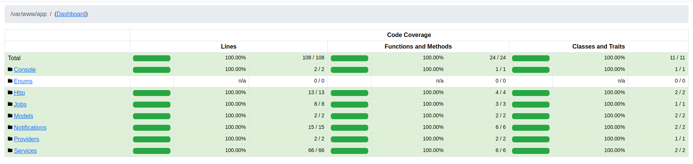

## Getting Started:
1. Copy environment file : cp .env.example .env
2. Build and start containers: docker compose up -d --build
3. Install PHP dependencies: docker compose exec app composer install
4. Generate Laravel application key: docker compose exec app php artisan key:generate
5. Run migrations: docker compose exec app php artisan migrate 
6. Access the application: http://localhost:8000
## Description:
You can test the API endpoint using Postman.
1. Subscribe to Price Updates:
```POST http://localhost:8000/api/subscribe```

   Request Body:
```json
{
  "url": "https://www.olx.ua/d/uk/obyavlenie/plattya-na-dvchinku-dityache-plattya-plate-na-devochku-ID10n2lJ.html?reason=ip%7Clister",
  "email": "test@gmail.com"
}
```

2. The service sends an email to the specified email address to confirm the subscription. At the moment, emails are written to laravel.log (currently MAIL_MAILER=log is set).
3. In the email, the user must follow the link to confirm their email.
4. The service monitors price changes for the listing and sends notifications if the price changes.
If the user has not confirmed their email for the subscription, they will not receive price change notifications.

*Possible future improvements*: authentication, adding translations, email templates.

The code has 100% test coverage (You can run ```php artisan test --coverage-html reports```).

